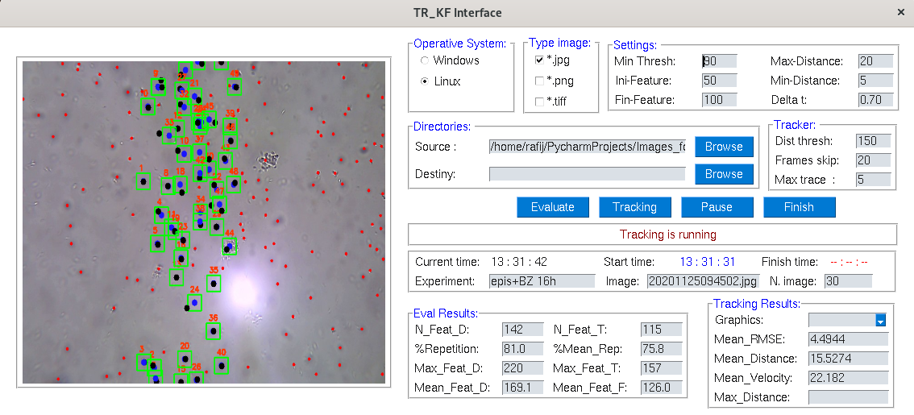
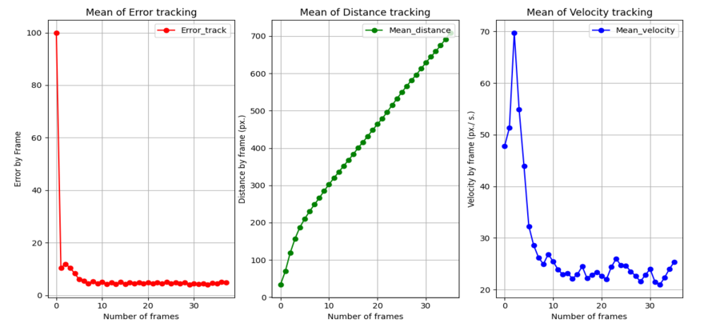

# TR_KF Interface
TR_KF by **Multi Tracking objects with Kalman Filter** is a GUI Interface programmed in *PYTHON* using PySimpleGUI for object detection and tracking process in a sequence of images.
This is a test version 1.2.5

In the directory */src*, you will find an user guide document.

## Run of TR_KF Interface
This program can be used for object detection and evaluate the performance of filter and morphological operations which could be changed. A repeatability measure is used to show results.
For multi-tracking, the Kalman Filter is used where features detected are identified in a radius value. 

## Results of TR_KF Interface
Results of whole set of features tracked are presented in 2 graphics which are related with the mean distance and mean velocity computed during the sequence of images.
Error is the measure of the Kalman filter for the detection process.

TR_KF Interface will be presented in a **scientific paper**.
