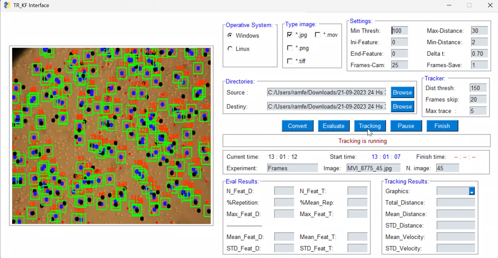
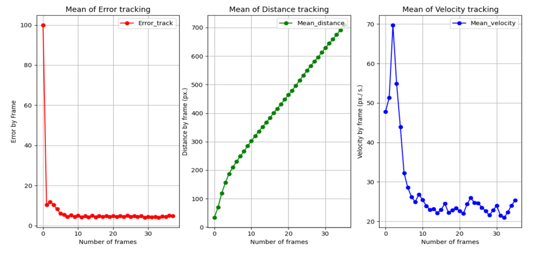

# TR_KF Interface
TR_KF by **Multi Tracking objects with Kalman Filter** is a GUI Interface programmed in *PYTHON* using PySimpleGUI for the object detection and tracking process in a sequence of images.
This is a new version 2.1.1 from the last version 1.2.5

In the directory */src*, you will find a user guide document.

## Run of TR_KF Interface
This program can be used for object detection and to evaluate the performance of filters and morphological operations, which can be changed. A repeatability measure is used to show results.
For multi-tracking, the Kalman Filter is used, where detected features are identified within a radius value. 

## Results of TR_KF Interface
Results of the whole set of tracked features are presented in 2 graphics, which are related to the mean distance and mean velocity computed during the sequence of images.
Error is the measure of the Kalman filter for the detection process.

TR_KF Interface has been presented in the paper https://www.sciencedirect.com/science/article/abs/pii/S0026265X24009822
